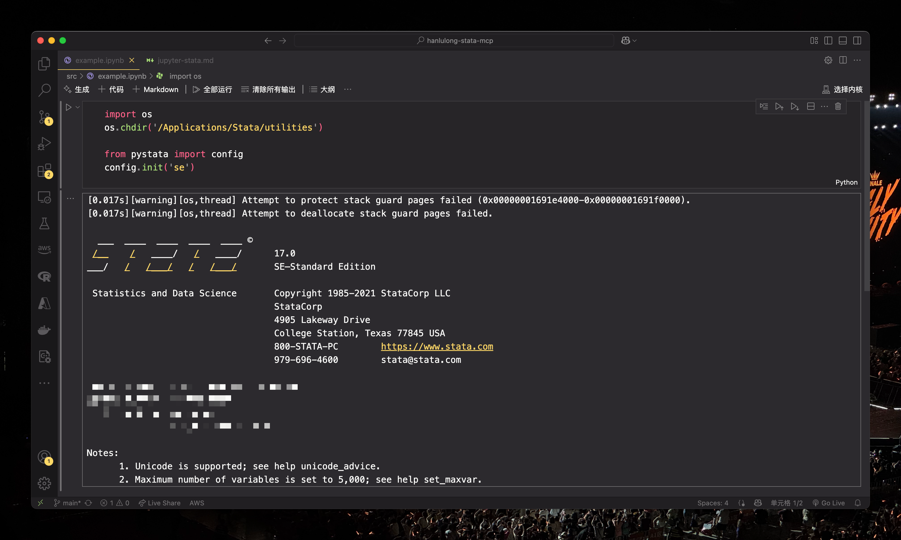
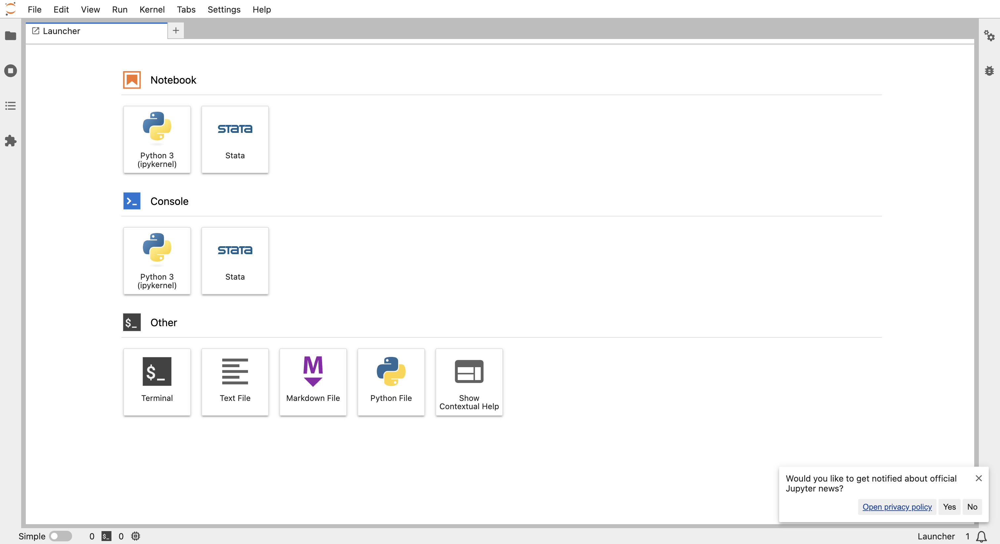

# Use Jupyter to serve your Stata
## Prepare
- Stata 17+
- conda
- VScode or Jupyter

## Config the infrastructure
### Python Environment
We support that you have the environment of conda(anaconda or miniconda).

Then run the follow code in your terminal (or PowerShell on Windows)
```bash
conda create -n Jupyter-Stata python=3.11
conda activate Jupyter-Stata

# If you are not sure whether you activate your env, you can run which python or python --version for insurance.
# which python
# python --version

# install the requirements
pip install jupyter stata_setup
```

### VScode config
Make a ".ipynb" file, then choose Jupyter Kernel.
If you are macOS and use the commands before, you can use follow path directly.
```text
/opt/anaconda3/envs/Jupyter-Stata/bin/python
```

```Jupyter
# macOS
import os
os.chdir('/Applications/Stata/utilities') 

from pystata import config
config.init('mp')  # if you are use 'stata-se' change it to 'se'

# Windows
import stata_setup
stata_setup.config("C:/Program Files/Stata17", "mp")
```

Then you can see the follow window:


### Jupyter Lab
If you like Jupyter Lab rather than VScode, use the follow usage.

1. open your Jupyter Lab
for example:
```bash
conda activate Jupyter-Stata
jupyter lab --notebook-dir="your/project/path"
```

Then you can see the window on your brower:


You can choose Notebook-Stata directly for use Stata Kernel, which is look like:


## Magic Command(on Vscode, or jupyter lab with python kernel)
The part is under the structure of [here](#vscode-config)
```jupyter
%%stata 
## multi line magic command

sysuse auto, clear
sum
reg price mpg rep78 trunk weight length
```

```jupyter
%stata scatter mpg price
```

By the way, if you use the python kenrel, you can use not only stata, but also python(pandas).


## An example usage (with python kernel)
- [example](examples/jupyter.ipynb) 


## Wraning!
You' d better not use PyCharm to write a Jupyter file whose content is Stata, because it would identify it as python code rather than Stata.
